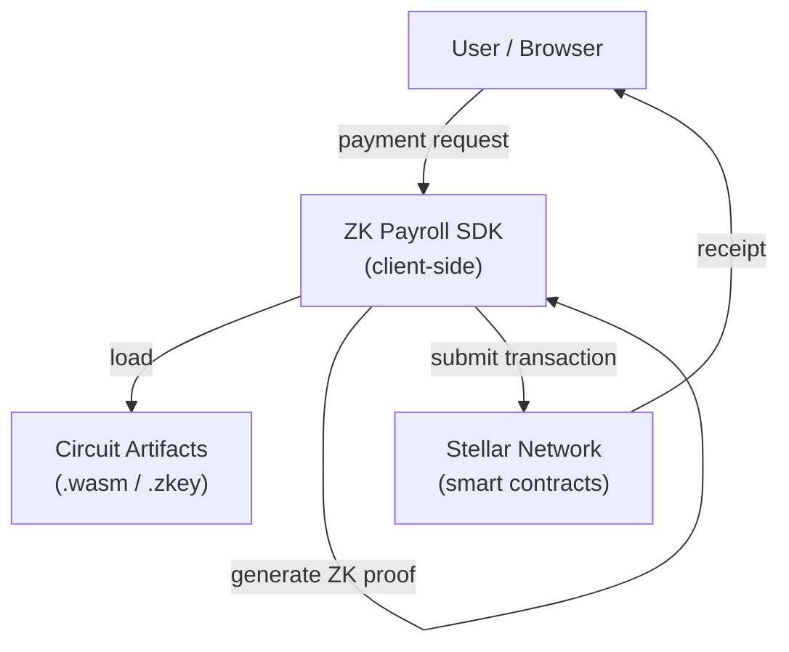
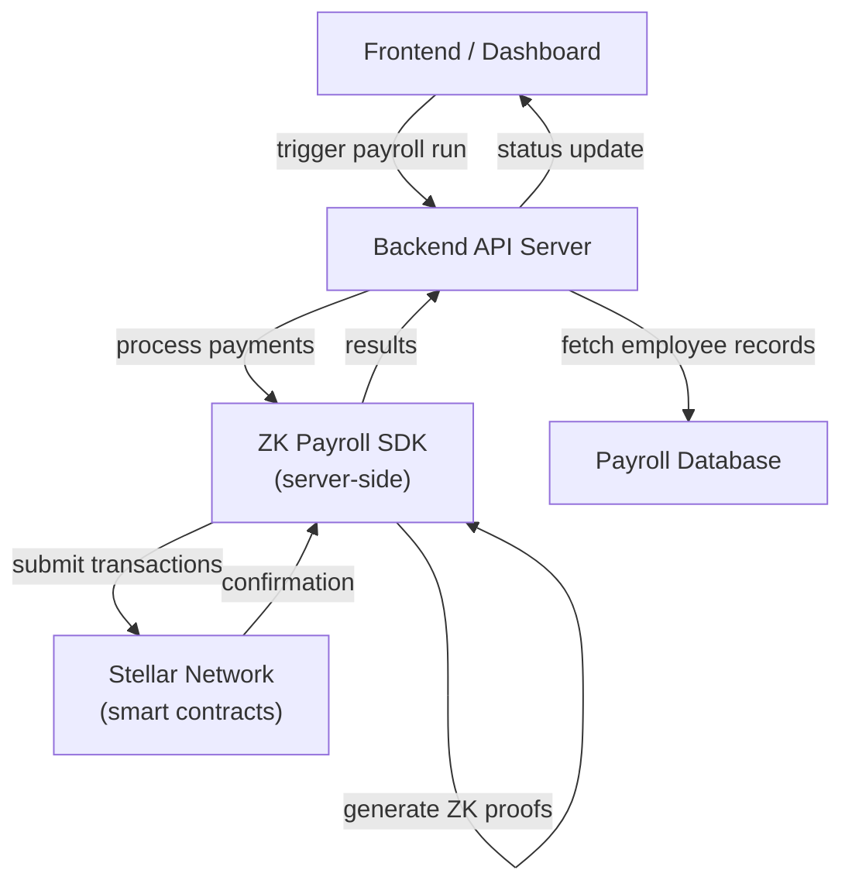

# Integration Patterns

Architecture diagrams showing how the ZK Payroll SDK fits into common deployment scenarios.

---

## Frontend-First Pattern

The SDK runs entirely in the browser. ZK proofs are generated client-side; the dApp submits transactions directly to the Stellar network.

**When to use:** Simple dApps, wallets, or dashboards where users hold their own keys and you want no backend infrastructure.

**SDK responsibilities:** Proof generation, contract interaction, caching of circuit artifacts.

---

## Backend Service Pattern

A server holds employer keys and orchestrates payroll runs. The SDK is used server-side; the frontend only displays status.

**When to use:** Employer-managed payroll automation, scheduled disbursements, or any flow where keys should not be exposed to the browser.

**SDK responsibilities:** Batch proof generation, contract calls, error handling and retries.

---

## Key Differences

| | Frontend-First | Backend Service |
|---|---|---|
| Proof generation | Client browser | Server process |
| Key custody | User's wallet | Server / HSM |
| Scalability | Per-user | Centralized, batchable |
| Privacy | High (keys never leave client) | Depends on server trust model |

## Further Reading

- [Backend Worker Quickstart](./BACKEND_WORKER_QUICKSTART.md) — practical starter guide for internal automation workers
- [ZK Proof Generation](./ZK_PROOF_GENERATION.md) — how proofs are constructed
- [API Reference](./API.md) — full SDK API
- [ZK Architecture](./zk-architecture.md) — circuit and contract design
